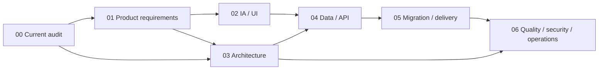

# Twitch Bot v2 再構築設計

## この資料の位置づけ

このディレクトリは、現行の Twitch Bot を運用しながら次世代版（以下 v2）を
一から再構築するための設計パッケージである。2026-08-13 時点のコード、テスト、
既存ドキュメント、Twitch 公式仕様を基準にしている。

ここで定義するのは実装前の推奨案であり、現行アプリ、実データ、認証情報、
Docker/Portainer 環境を変更するものではない。`Recommended` と `Open` の項目は、
実装着手前に承認または変更する。

## 結論

v2 は、既存機能を単純に移植した SPA ではなく、次の方針で作る。

1. 配信中の判断と操作を最短にするタスク指向 UI に再編する。
2. Flask のモジュラーモノリスと単一コンテナを維持し、責務境界を作り直す。
3. Twitch EventSub と Helix API を中心にし、IRC 依存を段階的に解消する。
4. 運用データは SQLite、秘密情報は分離ストア、VOD 本体は
   `/app/downloads` のまま管理する。
5. 現行 JSON/JSONL は上書きせず、検証可能なインポートと段階切替で移行する。
6. `GET /api/stream/status` のキャッシュ限定・read-only 契約を永久互換面として残す。

## 設計資料

| 資料 | 決めること |
|---|---|
| [00-current-state-audit.md](00-current-state-audit.md) | 現行機能、強み、課題、改善優先度 |
| [01-product-requirements.md](01-product-requirements.md) | 目的、利用者、スコープ、要件、成功指標 |
| [02-information-architecture-and-ui.md](02-information-architecture-and-ui.md) | 情報設計、画面、操作フロー、デザインシステム |
| [03-system-architecture.md](03-system-architecture.md) | 技術選定、モジュール、Twitch 接続、バックグラウンド処理 |
| [04-data-and-api.md](04-data-and-api.md) | データモデル、保存境界、API 契約、互換性 |
| [05-migration-and-delivery.md](05-migration-and-delivery.md) | 段階移行、リリース単位、ロールバック、Definition of Done |
| [06-quality-security-operations.md](06-quality-security-operations.md) | テスト、性能、セキュリティ、可観測性、運用 |

## 意思決定の状態

| 状態 | 意味 |
|---|---|
| `Locked` | 現行プロジェクトの耐久ルール。v2 でも変更しない |
| `Recommended` | この設計パッケージの推奨。実装開始時に決定記録へ昇格する |
| `Open` | 利用者の選択または短い技術検証が必要 |

## Locked: 変更しない境界

- Twitch 配信用 Bot と管理ダッシュボードであり続ける。
- Raspberry Pi と `linux/arm64` を第一ターゲットとする。
- 単一 Docker コンテナ、gunicorn、ホストネットワーク、ポート `8501`、
  `/app/data` と `/app/downloads` のマウント境界を維持する。
- GHCR へのマルチアーキテクチャ image publish と、Portainer での手動配備を維持する。
- `GET /api/stream/status` はワーカーが既に保持する実際の Twitch 状態だけを返す。
  リクエスト中に Twitch API や外部サービスを呼ばない。
- externally visible な配信スナップショットは配信終了または Bot 無効時に消去する。
- secretary-bot 通知、OBS 制御・状態・設定、VOD-to-OBS 移行を導入しない。
- Twitch VOD ダウンロードは独立機能として維持し、自動取得は
  `enable_vod_download` のみで制御し、初期値を無効のままにする。
- 認証情報、現行 runtime data、視聴者/履歴データ、メディアを設計・テストで使用しない。

## Recommended: v2 の基本構成

| 領域 | 推奨 |
|---|---|
| Backend | Python 3.12 / Flask 3 / app factory / 型付きサービス境界 |
| UI | Jinja2 shell + Vanilla JavaScript ES modules + project-local CSS |
| Runtime | gunicorn 1 worker + threads、明示的な runtime supervisor |
| Twitch | EventSub WebSocket（受信）+ Helix API（コマンド） |
| Persistence | Python 標準 `sqlite3` + migration runner |
| Realtime UI | 集約 snapshot API の適応的 polling。SSE/WebSocket は初期範囲外 |
| Charts | バージョン固定した project-local chart asset |
| Tests | pytest、fake Twitch adapters、契約テスト、ブラウザ E2E |

この構成は React/FastAPI/Redis 等を否定するものではない。単一利用者・単一チャンネル、
Raspberry Pi、単一コンテナという現実の運用に対して、追加ランタイムと分散状態を
持ち込まずに十分な分離と UI 品質を得る選択である。

## UI concept preview

`/live` の優先順位と responsive behavior を具体化した会話内 preview は、この設計パッケージとは
別の一時 artifact として作成している。repository へ UI implementation や generated image を追加した
わけではない。実装開始時は [02-information-architecture-and-ui.md](02-information-architecture-and-ui.md)
を正とし、offline/live/degraded の browser prototype を project 内で改めて作る。

## 設計の読み方

## 実装へ進む前の承認ゲート

次の 4 点を承認した時点で、最初の実装 handoff を作る。

1. UI の第一階層を「ライブ・自動化・コミュニティ・分析・アーカイブ・設定」とする。
2. 運用データの保存先として SQLite を採用し、現行 JSON/JSONL は import 元として残す。
3. 新規チャット受信を EventSub 中心とし、IRC を移行期間だけ併存可能にする。
4. 初回リリースを機能一括置換ではなく、read-only 画面から段階的に切り替える。
5. Bot と broadcaster を別 credential actor として扱い、同一アカウント時だけ安全に共有する。

## 現行監査の主な根拠

- 機能と運用: [`README.md`](../../README.md)
- 起動とワーカー: [`app.py`](../../app.py)、[`services/workers.py`](../../services/workers.py)
- 共有状態と JSON: [`config.py`](../../config.py)、[`services/storage.py`](../../services/storage.py)
- 画面と API: [`routes/`](../../routes)、[`templates/`](../../templates)、[`static/`](../../static)
- 保護挙動: [`tests/test_stream_status.py`](../../tests/test_stream_status.py)、
  [`tests/test_workers_snapshot.py`](../../tests/test_workers_snapshot.py)
- 現行の改善候補: [`docs/improvements.md`](../improvements.md)

## 外部仕様の一次資料

- [Twitch Chat & Chatbots](https://dev.twitch.tv/docs/chat/)
- [Authenticating and Setting up EventSub](https://dev.twitch.tv/docs/chat/authenticating/)
- [IRC migration guide](https://dev.twitch.tv/docs/chat/irc-migration/)
- [EventSub](https://dev.twitch.tv/docs/eventsub/)
- [EventSub WebSocket handling](https://dev.twitch.tv/docs/eventsub/handling-websocket-events/)
- [Twitch Authentication](https://dev.twitch.tv/docs/authentication/)
- [Refreshing access tokens](https://dev.twitch.tv/docs/authentication/refresh-tokens/)
- [Twitch API guide / rate limits](https://dev.twitch.tv/docs/api/guide/)
- [Twitch API reference](https://dev.twitch.tv/docs/api/reference)
